# Scam-Buster 全量事件与交互树

> 文档状态：基于本地 v14 工作树生成。ADCC 扩充事件已经接入本地状态机并通过专项回归；GitHub Pages 线上版本尚未包含本次未提交修改。

## 目录

1. [规则与图例](#1-规则与图例)
2. [全局总树](#2-全局总树)
3. [自由回复系统](#3-自由回复系统)
4. [包裹与交换文件](#4-包裹与交换文件)
5. [迎新联系人陌生来电](#5-迎新联系人陌生来电)
6. [政府机构冒充来电](#6-政府机构冒充来电)
7. [冒充教授的研究邀请](#7-冒充教授的研究邀请)
8. [Student Innovation Night 活动](#8-student-innovation-night-活动)
9. [远程研究与兼职任务](#9-远程研究与兼职任务)
10. [医疗服务自动续费](#10-医疗服务自动续费)
11. [二手平台收款验证](#11-二手平台收款验证)
12. [Mandy 熟人账号](#12-mandy-熟人账号)
13. [损失后的二次追款](#13-损失后的二次追款)
14. [PolyULife 全部入口](#14-polyulife-全部入口)
15. [浏览器完整搜索树](#15-浏览器完整搜索树)
16. [电话、联系人、银行、任务与设置](#16-电话联系人银行任务与设置)
17. [Outlook 邮件非剧情操作](#17-outlook-邮件非剧情操作)
18. [结束今天与复盘](#18-结束今天与复盘)
19. [金额、资料与状态后果矩阵](#19-金额资料与状态后果矩阵)
20. [无结果入口与当前边界](#20-无结果入口与当前边界)

---

## 1. 规则与图例

- **必须事项**：影响桌面待办进度；目前只有“领取交换申请文件”和“确认迎新联系人”。
- **可选事件**：可以查看、处理、延后或完全忽略，不算任务失败。
- **资料暴露**：记录玩家在短信、邮件、网页、电话或远程协助中提供的资料程度。
- **金钱损失**：只统计被系统判定为诈骗或越权付款的金额；某些真实付款只减少余额，不计诈骗损失。
- **独立来源**：玩家离开原消息或来电，从另外找到的号码、网站、联系人或App重新查询。
- **未知号码**：诈骗电话和官方查询电话的通话画面统一显示“未知号码”，不自动显示机构身份。
- **返回／主页**：玩家可以随时离开当前页面；系统不会因为返回而自动判断真假。

### 随机变量

| 随机项目 | 概率 | 实际情况 |
| --- | ---: | --- |
| 迎新来电者 | 32% | 真正的阿杰换了号码 |
| 迎新来电者 | 46% | 完全冒充阿杰 |
| 迎新来电者 | 22% | 人物真实，但只是场地承办商联系人，要求越权 |
| Mandy账号 | 72% | Mandy账号被盗 |
| Mandy账号 | 28% | 确实是Mandy本人 |

---

## 2. 全局总树

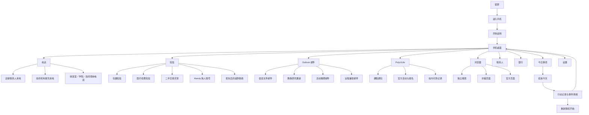

### 桌面必须事项

```text
今日事项
├─ 领取交换申请文件
│  ├─ 查看收发室通知
│  ├─ 取得完整运单号
│  ├─ 向独立渠道确认
│  └─ 前往收发室领取
└─ 确认迎新联系人
   ├─ 回拨未接来电了解来意
   ├─ 检查原有联系方式
   ├─ 向共同联系人核对
   └─ 确认今年联络方式
```

研究邀请、活动、兼职、医疗、二手交易、Mandy和政府来电都不会出现在桌面待办中。

---

## 3. 自由回复系统

### 3.1 短信与邮件

```text
玩家自由输入
├─ 拒绝类
│  └─ 不、不要、不会、不能、拒绝、取消、not、cannot、decline、refuse…
├─ 敏感资料类
│  └─ 密码、验证码、学号、身份证、护照、银行卡、卡号、CVV、OTP…
│     └─ 每次回复资料暴露 +1
├─ 付款类
│  └─ 转账、付款、支付、FPS、礼券、购买、pay、transfer、voucher…
├─ 查询类
│  └─ 核实、确认、官网、官方、学院、部门、收发室、邮政、verify、official…
├─ 提问类
│  └─ 谁、什么、为什么、怎样、哪里、何时、who、what、why、how、where…
└─ 其他普通回复
```

通用后果：

- 回复会写进本机剧情记录。
- 系统约0.65至0.85秒后生成对方回复。
- 短信或邮件回复本身不会自动付款、完成任务或打开网页。
- 敏感内容会增加资料暴露。
- 真正付款仍需要点击网页、活动或银行确认操作。

### 3.2 电话

```text
电话自由输入
├─ 询问身份
├─ 询问来意
├─ 询问文件／案件／编号
├─ 要求证明或共同经历
├─ 提供部分资料
├─ 提供完整资料
├─ 拒绝提供
├─ 提出付款
├─ 表示要另行查询
├─ 结束通话
└─ 无法识别的普通问题
```

电话与短信/邮件不同：电话回复会直接改变对话节点、资料暴露和部分任务状态。

### 3.3 挂断行为

```text
结束电话
├─ 立即结束当前通话
├─ 保存已经发生的对话与资料披露
├─ 返回原应用
└─ 不弹出真假判断或判断依据
```

- 不要求玩家为来电贴上“可信”或“可疑”标签。
- 玩家可直接按挂断、返回或主页离开，再自行使用其他应用。
- 系统只保存客观行动与后果，不把离开视为任何判断。

---

## 4. 包裹与交换文件

### 4.1 总树

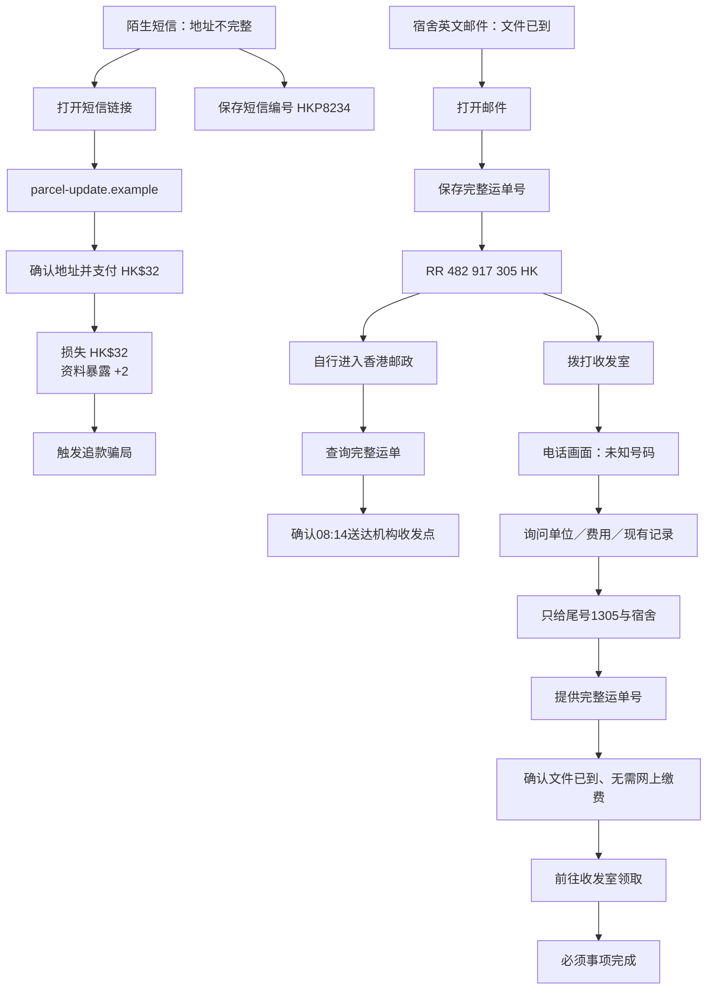

### 4.2 宿舍邮件

```text
Hall Reception邮件
├─ 打开
│  └─ 必须事项：noticeRead = true
├─ 翻译／查看原文
│  └─ 不改变剧情
├─ 保存完整运单号
│  └─ trackingSaved = true
├─ 回复提问／核实／付款
│  └─ 对方再次说明带学生证到收发室，不通过短信收取重新派送费
└─ 普通回复
   └─ 文件保留到17:00
```

### 4.3 包裹短信

```text
未知号码短信
├─ 保存HKP8234
│  └─ 只保存不完整编号
├─ 自己搜索parcel-update.example
│  └─ 浏览器同时显示假页面、Scameter及香港邮政
├─ 打开短信链接
│  └─ 假页面要求HK$32重新处理费
└─ 自由回复
   ├─ 拒绝／核实 → 称两小时后退回，要求不要致电其他号码
   ├─ 敏感资料 → 要求填写到网页
   ├─ 提问 → 声称详情只在链接中
   ├─ 付款 → 重复HK$32费用
   └─ 普通 → 催促两小时内处理
```

### 4.4 收发室电话

```text
拨打+852 2XXX 0000
└─ 电话画面仍显示未知号码
   ├─ 询问身份
   │  └─ 自称宿舍收发室
   ├─ 描述文件
   │  └─ 要求运单尾号和宿舍
   ├─ 询问费用
   │  └─ 一般领取不需网上付款
   ├─ 只提供尾号1305
   │  └─ 找到可能记录，但要求完整编号
   ├─ 提供完整运单号
   │  ├─ 未在邮件保存完整编号 → 无法确认，返回邮件
   │  └─ 已保存完整编号 → 得到领取时间、地点及无需缴费
   ├─ 拒绝透露
   │  └─ 可稍后再查询
   └─ 记录结果
      └─ hallConfirmed = true
```

### 4.5 领取结局

```text
hallConfirmed = false
└─ 不能完成领取按钮

hallConfirmed = true
└─ 前往收发室领取
   ├─ collected = true
   ├─ parcel.status = done
   └─ 必须事项完成
```

---

## 5. 迎新联系人陌生来电

### 5.1 共用入口

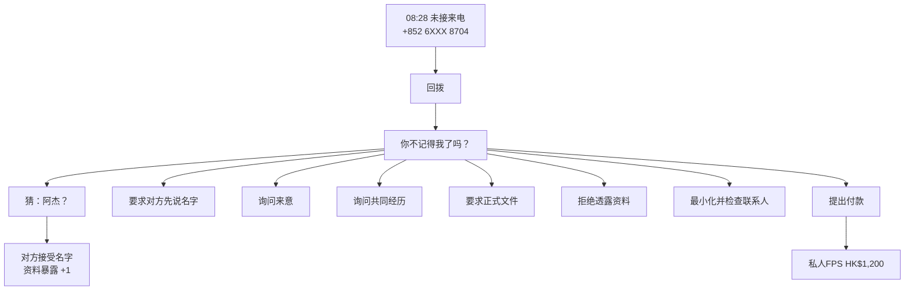

### 5.2 通用对话节点

```text
intro
├─ ask_identity → identity
├─ guess_name → guessed
├─ ask_purpose → purpose
├─ refuse_disclosure → cautious
└─ 其他 → fallback

identity / guessed
├─ ask_purpose → purpose
├─ ask_reference → reference
└─ hold_research → 联系人

purpose
├─ ask_document → document
├─ refuse_disclosure → cautious
└─ hold_research → 联系人

document
├─ hold_research → 联系人
├─ refuse_disclosure → cautious
└─ offer_payment → HK$1,200付款确认

cautious
├─ hold_research → 联系人
├─ ask_reference → reference
└─ end_call → 直接结束通话
```

### 5.3 真正阿杰换号（32%）

```text
询问身份
└─ 自称阿杰，提到N座迎新摊位

询问来意
└─ 表示换了号码
   └─ 供应商有订金资料需要查看
      └─ 明确称不需玩家私人付款

询问共同经历
└─ 能说出嘉敏迟到、一起搬物资

要求文件
└─ 答应发送学院报价单
   └─ 款项应由学院账户处理

联系阿杰旧号码
└─ 旧号码无法接通
   └─ oldNumberCalled = true，但尚未完全确认

联系嘉敏
└─ 确认新号码尾号8704
   └─ 说明订金不应由学生私人转账
      └─ contact.status = done
```

如果玩家仍强行支付HK$1,200：

- 余额减少HK$1,200。
- 由于身份确实是阿杰，代码目前不计入诈骗损失。
- 迎新事项标记完成。

### 5.4 完全冒充阿杰（46%）

```text
询问身份
└─ 避免主动说名字

玩家猜“阿杰”
└─ 对方立即承认自己是阿杰

询问来意
└─ 声称供应商急收HK$1,200订金

询问共同经历
└─ 反过来要求玩家先提供线索

要求正式文件
└─ 以时间紧迫为由拒绝

拒绝提供资料
└─ 使用关系压力和限时压力

联系阿杰原号码
└─ 真正阿杰否认换号及转账要求
   └─ contact.status = done

联系嘉敏
└─ 嘉敏确认阿杰仍使用原号码
   └─ contact.status = done

支付HK$1,200
├─ 余额减少HK$1,200
├─ moneyLost += 1200
└─ 触发追款骗局
```

### 5.5 人物真实但要求越权（22%）

```text
来电者
└─ 阿伦，场地公司联系人

来意
└─ 要求提供学生姓名和电话名单

询问权限
└─ 只能证明参与场地联络
   └─ 不能证明获授权索取名单或私人付款

联系阿杰
└─ 阿杰确认可能有阿伦此人
   └─ 没有授权他索取资料

联系嘉敏
└─ 嘉敏确认人物真实
   ├─ 只负责场地时间
   ├─ 无权取得学生名单
   └─ 无权要求私人付款

支付HK$1,200
├─ 余额减少HK$1,200
├─ moneyLost += 1200
└─ 触发追款骗局
```

---

## 6. 政府机构冒充来电

### 6.1 主电话树

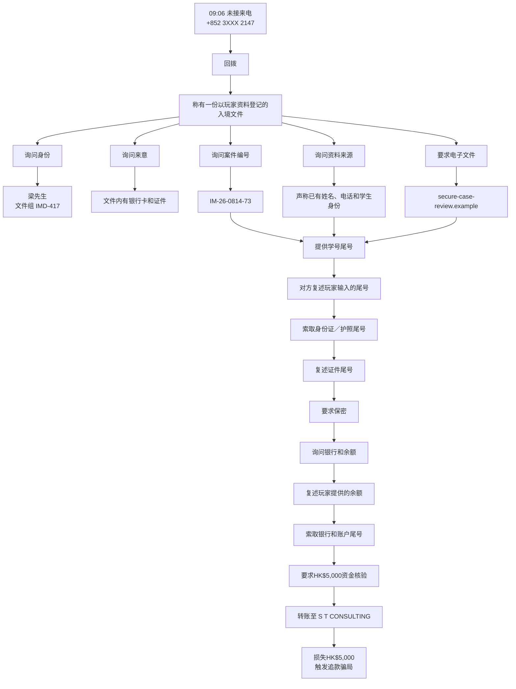

### 6.2 自由回复识别

```text
询问“你是谁／什么单位”
└─ identity

询问“什么事／为什么找我”
└─ purpose

询问“案件／案号／编号”
└─ case

询问“哪里拿到号码／资料来源”
└─ source

询问“为什么不能告诉学校／为什么保密”
└─ confidentiality

要求文件
└─ document

在case/source/document节点输入至少4位数字
└─ share_student_id
   ├─ studentIdShared = true
   ├─ 资料暴露 +1
   └─ 对方在下一句复述尾号

在student节点输入至少4位数字
└─ share_identity_digits
   ├─ identityDigitsShared = true
   ├─ 资料暴露 +2
   └─ 对方在下一句复述证件尾号

在identity_checked/confidentiality/assets节点谈到余额或金额
└─ share_balance
   ├─ 资料暴露 +1
   └─ 对方复述余额

在balance/assets节点谈到银行或户口
└─ share_bank
   ├─ bankingDetailsShared = true
   ├─ 资料暴露 +2
   └─ 进入HK$5,000资金核验

输入“我转／可以付／怎么转”
└─ 打开FPS转账确认

拒绝提供
└─ 对方以文件会转交处理施压

表示要核实／查一下
└─ 最小化通话并搜索当前号码
```

### 6.3 假文件页面

```text
secure-case-review.example
├─ 案件编号 IM-26-0814-73
├─ Document Investigation Desk
├─ Assigned Officer Lau
├─ 如果玩家已提供学号尾号
│  └─ 页面显示相同尾号
└─ 要求保持电话会话进行身份及账户检查
```

### 6.4 独立查询树

```text
离开或最小化通话
├─ 搜索+852 3XXX 2147
│  ├─ Scameter暂无公开记录
│  └─ 电话簿没有机构匹配
├─ 搜索“入境事务处电话”
│  ├─ www.immd.gov.hk
│  └─ secure-case-review.example广告结果
└─ 打开政府网站
   ├─ officialDirectoryOpened = true
   ├─ 联系人中出现General Enquiries
   └─ 得到+852 2XXX 6111
      └─ 拨打
         ├─ 电话画面仍显示未知号码
         ├─ 询问事件／案件
         ├─ 提供IM-26-0814-73或IMD-417
         └─ 查询结果
            ├─ 没有该案件
            ├─ 没有该职员编号
            ├─ 不会电话转驳调查主任
            └─ 不会要求向公司账户做资金核验
```

### 6.5 可能结局

```text
完全忽略
└─ 不回拨09:06未接来电

回拨后离开
└─ callbackMade = true，通话存档但不要求判断

提供部分资料后挂断
└─ 保留资料暴露，不发生付款

支付HK$5,000
├─ depositPaid = true
├─ government.status = loss
├─ moneyLost += 5000
└─ 触发追款骗局

从政府网站另拨号码并查询案件
├─ officialNumberCalled = true
├─ resolved = true
└─ government.status = done
```

---

## 7. 冒充教授的研究邀请

### 7.1 总树

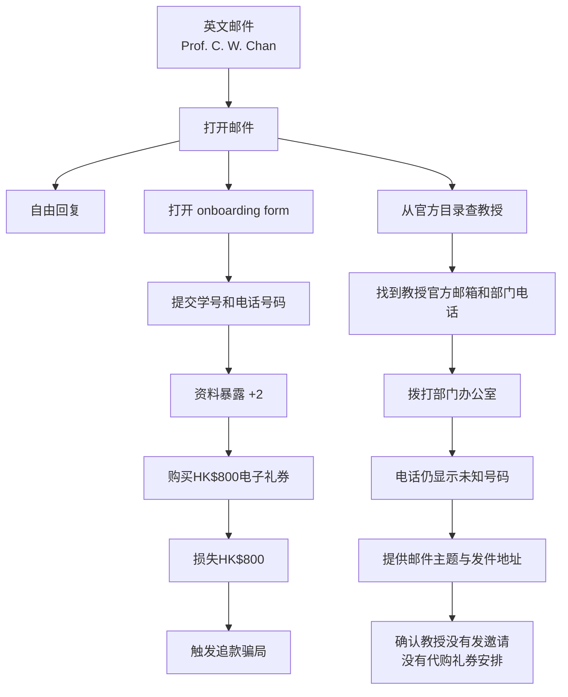

### 7.2 邮件自由回复

```text
拒绝
└─ 对方称机会今天截止

提出核实
└─ 对方称教授正在开会，无需联系学院

发送敏感资料
└─ 要求放进onboarding form建立报销档案

谈到付款
└─ 要求先购买礼券，之后报销

普通回复
└─ 催促今天完成入职表
```

### 7.3 假入职路径

```text
打开research-onboarding.example
├─ 显示时薪HK$180
├─ 提交学生资料
│  ├─ invitationRead = true
│  ├─ 资料暴露 +2
│  └─ 出现首项任务
└─ 购买HK$800礼券
   ├─ 余额减少HK$800
   ├─ moneyLost += 800
   ├─ 银行通知
   └─ 触发追款骗局
```

### 7.4 官方查询路径

```text
打开www.polyu.edu.hk/staff
├─ officialProfileFound = true
├─ 找到模拟教授官方邮箱
└─ 得到Department General Office +852 2XXX 6200
   └─ 拨打
      ├─ 询问办公室身份
      ├─ 描述研究邀请
      ├─ 提供主题和发件地址
      └─ 确认没有该项目或礼券安排
         ├─ officialContacted = true
         ├─ resolved = true
         └─ research.status = done
```

---

## 8. Student Innovation Night 活动

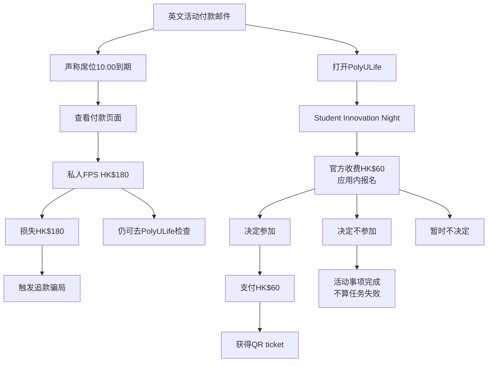

### 邮件自由回复

```text
拒绝
└─ 称席位10:00到期

提出核实
└─ 称活动台很忙，个人FPS是最快方式

提供敏感资料
└─ 要求在付款页填写并回复学生编号与截图

谈到付款
└─ 支付HK$180后回复截图换QR ticket

普通回复
└─ 继续催促保留席位
```

### 假付款路径

```text
student-event-payment.example
└─ 支付私人FPS HK$180
   ├─ 余额减少HK$180
   ├─ moneyLost += 180
   ├─ 银行通知
   ├─ QR ticket仍等待人工审核
   └─ 触发追款骗局
```

### 官方活动路径

```text
PolyULife活动详情
├─ 日期：Friday, August 14
├─ 地点：Jockey Club Auditorium
├─ 官方收费：HK$60
├─ 决定参加
│  ├─ 余额减少HK$60
│  ├─ 不计诈骗损失
│  ├─ registered = true
│  ├─ decision = attend
│  └─ 获得QR ticket
├─ 决定不参加
│  ├─ decision = skip
│  └─ event.status = done
└─ 暂不决定
   └─ 保持pending
```

---

## 9. 远程研究与兼职任务

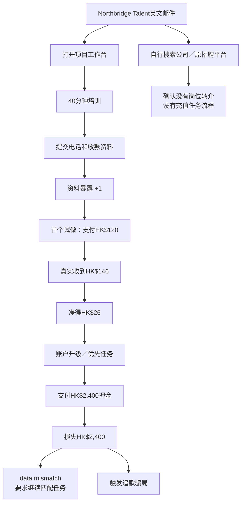

### 邮件自由回复

```text
拒绝
└─ 邀请今天失效

要求核实
└─ 称由项目团队负责，培训工作台就是最快核实方式

提供敏感资料
└─ 要求手机号和付款资料才能发放佣金

询问付款
└─ 强调第一单金额小、会即时返佣

普通回复
└─ 引导进入40分钟培训与试做
```

### 工作台阶段

```text
Stage 1 Training
└─ 提交个人资料
   ├─ profileSubmitted = true
   └─ 资料暴露 +1

Stage 2 Trial
└─ 支付HK$120购买样品
   ├─ 余额 -120
   ├─ 即时到账 +146
   ├─ 净变化 +26
   └─ largeDepositRequested = true

Stage 3 Commission
└─ 显示真实返佣及优先任务

Stage 4 Priority
└─ 支付HK$2,400任务押金
   ├─ 余额 -2400
   ├─ moneyLost += 2400
   ├─ 页面声称数据不匹配
   └─ 触发追款骗局
```

### 独立核实

```text
搜索Northbridge／原招聘平台
└─ 确认
   ├─ 原职位没有把玩家转给Northbridge
   ├─ 公司没有该研究助理职位
   └─ 没有购买样品、充值、返佣的入职流程
      └─ career.status = done
```

---

## 10. 医疗服务自动续费

```text
医疗服务短信
├─ 声称免费试用今日结束
├─ 自由回复
│  ├─ 拒绝／核实
│  │  └─ 坚持只能通过短信专用页面取消
│  ├─ 提问
│  │  └─ 声称资料已登记
│  ├─ 敏感资料／付款
│  │  └─ 要求在取消页面输入银行卡
│  └─ 普通回复
│     └─ 催促避免开始每月收费
├─ 打开medical-service-cancel.example
│  └─ 确认取消服务
│     ├─ 资料暴露 +2
│     ├─ 余额 -388
│     ├─ moneyLost += 388
│     ├─ 页面称取消正在审核
│     └─ 触发追款骗局
└─ 自行搜索医疗应用
   └─ 官方账户显示
      ├─ 没有保障试用
      ├─ 没有自动续费
      └─ 没有待取消项目
```

---

## 11. 二手平台收款验证

```text
二手平台买家
├─ 声称已支付HK$680
├─ 自由回复
│  ├─ 拒绝／核实
│  │  └─ 催促不要取消订单，否则钱会卡住
│  ├─ 提问
│  │  └─ 声称验证页会显示付款记录
│  └─ 普通回复
│     └─ 催促尽快完成验证
├─ 打开marketplace-protection.example
│  └─ 连接银行卡
│     ├─ 资料暴露 +2
│     ├─ 余额 -680
│     ├─ moneyLost += 680
│     ├─ 页面声称金额不匹配
│     └─ 触发追款骗局
└─ 返回平台内订单
   └─ 实际没有收到付款
      └─ 保存独立查询结果
```

---

## 12. Mandy 熟人账号

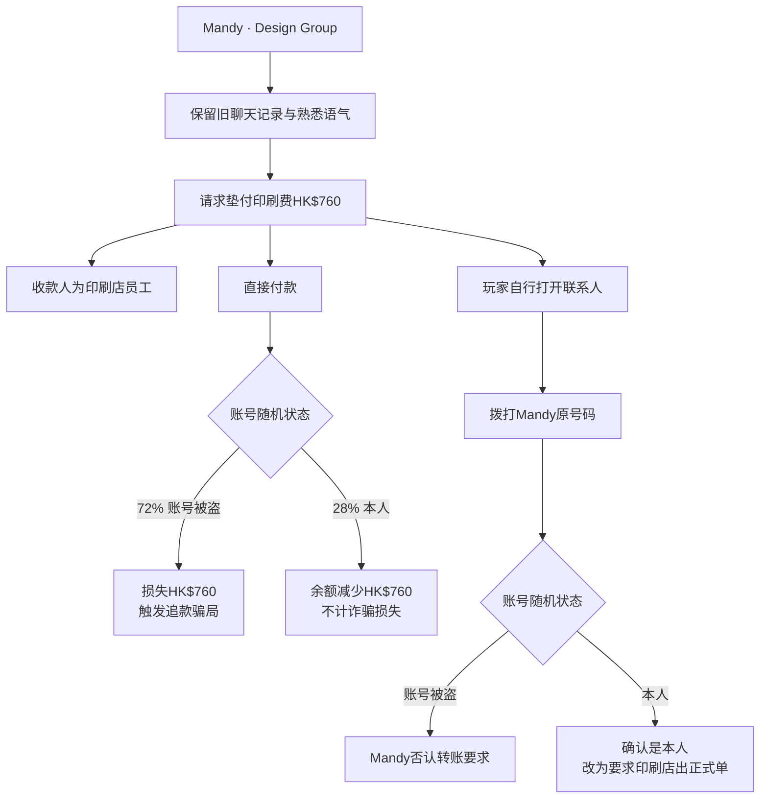

### 自由回复差异

```text
账号被盗版本
├─ 玩家提出核实／拒绝
│  └─ 对方称手机没电，不能接原号码
├─ 玩家提问印刷店
│  └─ 利用蓝色poster旧记录增强真实感
├─ 玩家谈到付款
│  └─ 要求转完截图
└─ 普通回复
   └─ 使用群体等待压力

本人版本
├─ 玩家提出核实／拒绝
│  └─ 同意玩家拨打平时号码
├─ 玩家提问印刷店
│  └─ 同样利用蓝色poster旧记录
├─ 玩家谈到付款
│  └─ 要求转完截图
└─ 普通回复
   └─ 催促先处理
```

### 付款与另行联系

```text
直接付款HK$760
├─ 余额 -760
├─ friend.status = done
├─ 账号被盗 → moneyLost += 760 → 触发追款骗局
└─ 本人账号 → 不计诈骗损失

联系人中拨打Mandy原号码
├─ originalNumberCalled = true
├─ friend.status = done
├─ 账号被盗 → Mandy说明账号被登入，否认付款要求
└─ 本人账号 → Mandy确认请求，但改为由印刷店出正式单
```

---

## 13. 损失后的二次追款

### 13.1 触发条件

第一次出现 `moneyLost > 0` 时，创建退款协助客服短信。来源可以是：

- 假包裹付款HK$32
- 研究礼券HK$800
- 假活动付款HK$180
- 高额兼职押金HK$2,400
- 医疗取消HK$388
- 二手收款验证HK$680
- 被盗Mandy账号HK$760
- 冒充／越权迎新来电HK$1,200
- 政府冒充资金核验HK$5,000

追款事件只会自动触发一次，但之后仍可能继续增加损失。

### 13.2 完整角色链

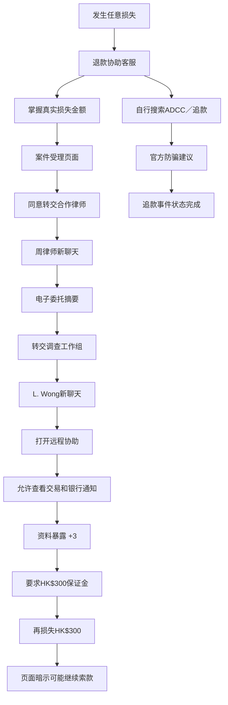

### 13.3 退款协助客服

```text
收到新短信
├─ 知道玩家真实损失金额
├─ 提供CA-随机编号
├─ 称初步受理不收费
└─ 声称资料只保留到18:00
```

自由回复：

```text
核实／拒绝
└─ 称可稍后决定，但建议先看案件摘要

提问
└─ 称自己只负责登记分流，法律意见由合作团队提供

普通回复
└─ 催促使用案件编号进入受理页面
```

### 13.4 受理台 → 律师

```text
claim-assistance.example/intake
├─ 显示真实损失金额
├─ 初步费用HK$0
├─ 时限18:00
└─ 同意转交合作律师
   ├─ intakeAccepted = true
   └─ 创建“周律师 · 资金追讨”聊天
```

律师自由回复：

```text
核实／拒绝
└─ 建议核对电子名片和委托摘要，并要求不要联系原收款人

提问
└─ 声称成功前不收律师费，但需建立保证账户

普通回复
└─ 要求打开委托摘要
```

### 13.5 律师 → 调查员

```text
chow-legal-associates.example/case
└─ 联系调查工作组
   ├─ investigatorContacted = true
   └─ 创建“调查工作组 · L. Wong”聊天
```

调查员自由回复：

```text
核实／拒绝
└─ 声称联合调查不能经一般热线核对，中断会失去冻结窗口

提供敏感资料
└─ 称不用在聊天发送密码，改为要求远程协助

谈到付款
└─ 声称保证金会连同追回款项退回

普通回复
└─ 要求打开协助页面
```

### 13.6 远程协助与保证金

```text
secure-case-assist.example/session
├─ 连接远程协助
│  ├─ remoteAccessGranted = true
│  ├─ bankingDetailsShared = true
│  └─ 资料暴露 +3
└─ 支付HK$300保证金
   ├─ guaranteePaid = true
   ├─ 余额 -300
   ├─ moneyLost += 300
   └─ 页面暗示可能继续要求合规金额
```

### 13.7 官方ADCC分支

```text
浏览器搜索ADCC／追回／追款
└─ www.adcc.gov.hk
   └─ 保存官方防骗资讯
      ├─ officialAdviceChecked = true
      └─ recovery.status = done
```

---

## 14. PolyULife 全部入口

```text
Home
├─ My Class
│  └─ COMP2033课室改至N003
├─ Event
│  └─ Student Innovation Night
├─ My Exam
├─ Map
├─ Room
├─ Food
├─ Apps
└─ Study progress

Calendar
├─ 月视图
│  ├─ 普通日期
│  ├─ 课程换室
│  └─ Student Innovation Night
├─ 事件列表
│  ├─ 课程事件
│  ├─ 活动事件
│  └─ 校历／假期事件
└─ 周课表
   └─ 课程方块与课室

Notification
├─ COMP2033课堂换室
├─ Student Innovation Night
├─ 没有待缴项目
└─ 学期日历更新

中央QR
└─ 模拟校园二维码，不调用摄像头

More
├─ Campus Map
│  └─ 收发室与N003位置
├─ eStudent
│  └─ 目前没有待缴项目
├─ Library
│  └─ 没有待领取预约或到期借阅
└─ Job Board
   └─ 当前说明页，尚无新剧情
```

### 有剧情后果的PolyULife入口

| 入口 | 后果 |
| --- | --- |
| Student Innovation Night详情 | 可参加、跳过或暂不决定 |
| eStudent付款记录 | 保存目前没有待缴项目的信息 |
| Campus Map | 显示收发室位置及开放时间 |
| 课程通知 | 确认COMP2033换至N003 |
| 其他日历、Room、Food、Library | 信息页面，不改变主要状态 |

---

## 15. 浏览器完整搜索树

```text
空白首页
├─ PolyU官网
├─ 教职员目录
├─ 香港邮政
└─ Scameter

搜索8704
├─ Scameter暂无记录
└─ 搜索已保存联系人

搜索2147
├─ Scameter暂无记录
└─ 公开电话簿无机构匹配

搜索入境／Immigration／IMMD
├─ www.immd.gov.hk
└─ secure-case-review.example广告结果

搜索邮箱／outlook.example／campus-mail.example／polyu.edu.hk
├─ PolyU教职员目录
└─ 域名与账户查询

搜索教授／Research／Chan
├─ 官方教授目录
└─ 假Research Onboarding

搜索招聘／兼职／Northbridge／Career
├─ 假项目工作台
└─ 原招聘平台与公司资料

搜索医疗／自动扣费／Health
├─ 假取消页面
└─ 官方医疗账户

搜索二手／Marketplace／Carousell
├─ 假收款验证
└─ 平台内订单

搜索ADCC／追回／追款／防骗
├─ 官方防骗建议
└─ Emergency Fund Recovery

搜索Event／Innovation／活动
├─ 官方校园活动
└─ 假活动付款页面

搜索parcel-update.example
├─ 假包裹页面
├─ Scameter
└─ 香港邮政

搜索包裹／邮政／运单／HKP8234／RR 482
├─ 香港邮政
└─ 假包裹更新中心

其他关键词
└─ 没有完全匹配结果
```

### 浏览器页面与动作

| 页面 | 主要动作 |
| --- | --- |
| www.hongkongpost.hk | 用完整运单查询送达状态 |
| www.polyu.edu.hk/staff | 查教授官方邮箱与部门电话 |
| www.immd.gov.hk | 取得政府一般查询电话 |
| www.cyberdefender.hk | 查看号码／网址是否有公开记录 |
| parcel-update.example | 支付HK$32假处理费 |
| research-onboarding.example | 提交资料并购买HK$800礼券 |
| student-event-payment.example | 支付HK$180私人FPS |
| northbridge-projects.example | 试做、返佣、HK$2,400押金 |
| medical-service-cancel.example | 提交银行卡并损失HK$388 |
| marketplace-protection.example | 连接银行卡并损失HK$680 |
| claim-assistance.example | 开始二次追款角色链 |
| secure-case-assist.example | 远程协助与HK$300保证金 |
| secure-case-review.example | 显示政府冒充案件假文件 |

---

## 16. 电话、联系人、银行、任务与设置

### 16.1 电话App

```text
最近通话
├─ 09:06 +852 3XXX 2147
│  └─ 政府机构冒充来电
├─ 08:28 +852 6XXX 8704
│  └─ 迎新联系人来电
├─ +852 2XXX 0000
│  └─ 收发室
└─ 玩家手动拨打记录

拨号键盘
├─ 尾号2147 → 政府冒充来电
├─ 尾号8704 → 迎新来电
├─ 与保存联系人尾号匹配 → 对应联系人
└─ 其他号码 → 暂时无法接通

最近通话
└─ 只显示号码、方向与时间，不显示系统身份或真假标签
```

### 16.2 联系人

```text
阿杰（去年迎新）
└─ 根据随机身份出现不同结果

嘉敏
└─ 根据随机身份确认阿杰／阿伦情况

Hall Reception
└─ 进入收发室电话状态机

Department General Office
└─ 进入学院电话状态机

Mandy
└─ 根据账号随机状态确认本人或账号被盗

General Enquiries
├─ 初始隐藏
└─ 打开政府网站后出现
   └─ 进入政府官方查询电话状态机
```

### 16.3 银行

```text
银行
├─ 查看可用余额
├─ 查看所有剧情交易
├─ 冻结银行卡
│  ├─ cardFrozen = true
│  └─ 不追回已经支付的款项
└─ 联系银行
   ├─ moneyLost = 0
   │  └─ 客服显示没有异常交易
   └─ moneyLost > 0
      └─ 客服记录网上交易并建议冻结卡
```

### 16.4 今日事项

```text
任务页
├─ 必须事项：包裹
├─ 必须事项：迎新联系人
├─ 已保存的信息
├─ 结束今天并查看记录
└─ 重新开始
```

研究、活动、职业、健康、二手、Mandy、政府来电和追款状态不会以必须任务卡显示。

### 16.5 设置

```text
语言
├─ 简体中文
└─ English

国家或地区
├─ 香港
├─ 中国大陆
├─ 美国
└─ 英国
```

- 系统语言改变手机界面。
- 邮件、短信和电话保留发送者原始语言。
- 地区改变日期、时间和金额格式。
- 地区不会改变香港剧情地点、HKD或+852号码。

---

## 17. Outlook 邮件非剧情操作

```text
收件箱
├─ Focused
├─ Other
├─ 仅未读
├─ 显示全部
├─ 打开单封邮件
└─ 邮件只在打开详情时标记已读

邮件详情
├─ 返回收件箱
├─ Flag
├─ Reaction
├─ 回复
│  ├─ 自由输入
│  ├─ 保存本机回复
│  └─ 生成模拟对方回复
├─ 转发
│  └─ 不发送真实邮件
├─ Print
│  └─ 模拟器中不可用
└─ 发件人右侧“…"
   ├─ 标记为未读
   ├─ Reply
   ├─ Forward
   ├─ Print
   ├─ Translate Message
   ├─ View Original
   └─ More Add-Ins
```

### 邮件语言规则

- PolyU相关邮件原文全部为英文。
- 翻译入口只在发件人右侧的三点菜单中。
- 翻译不会覆盖原始主题、正文、链接、金额或发件地址。
- 系统语言切换后，邮件原文仍保持英文。

### 当前邮件列表

| 邮件 | 分类 | 原文语言 | 剧情动作 |
| --- | --- | --- | --- |
| Hall Reception | Focused | 英文 | 保存完整运单号 |
| Prof. C. W. Chan | Focused | 英文 | 打开研究onboarding |
| Northbridge Talent | Focused | 英文 | 打开项目工作台 |
| Student Event Team | Other | 英文 | 打开活动付款页面 |
| Student Affairs旧联系人 | Other | 英文 | 查看相关联系人 |

---

## 18. 结束今天与复盘

### 18.1 复盘总树

```text
结束今天
├─ 必须事项完成数量
├─ 收件箱中的研究与活动选择
├─ Mandy账号处理
├─ 另一通政府来电
├─ 早期返佣兼职
├─ 损失后的追款流程
├─ 独立来源数量
├─ 资料暴露
├─ 金钱损失
├─ 银行卡是否冻结
└─ 迎新陌生来电真实身份
```

### 18.2 复盘风格

```text
独立信息 >= 4 且两个必须事项完成
└─ 完成闭环查证

独立信息 >= 3
└─ 建立独立证据

独立信息 >= 1
└─ 有核对意识

否则
└─ 凭感觉行动
```

### 18.3 分事件复盘

```text
研究邀请
├─ 官方电话确认冒充教授
├─ 已购买礼券但未核实
├─ 只看过邮件
└─ 完全没有打开

活动
├─ 官方报名并参加
├─ 查看后决定不参加
├─ 向私人FPS付款但未报名
├─ 只查看官方资料
└─ 完全没有处理

职业
├─ 支付高额押金
├─ 只做小额任务并收到返佣
├─ 从独立渠道核实
└─ 没有把陌生招聘当成任务

Mandy
├─ 通过原号码确认
├─ 直接支付
├─ 只看过请求
└─ 没有打开

政府来电
├─ 从政府网站另拨号码并查询案件
├─ 支付HK$5,000资金核验
├─ 回拨但停在中途
└─ 没有回拨

迎新来电
├─ 真正阿杰换号
├─ 完全冒充
└─ 人物真实但要求越权
```

### 18.4 复盘后操作

```text
继续查看手机
└─ 关闭复盘，保留当前状态

换一种情况重玩
├─ 清除当前剧情进度
├─ 保留语言、地区和声音设置
├─ 重新随机迎新联系人身份
├─ 重新随机Mandy账号状态
└─ 返回锁屏
```

---

## 19. 金额、资料与状态后果矩阵

| 事件 | 玩家操作 | 余额变化 | 诈骗损失 | 资料暴露 | 额外后果 |
| --- | --- | ---: | ---: | ---: | --- |
| 包裹短信 | 假页面付款 | -HK$32 | +HK$32 | +2 | 触发追款 |
| 迎新来电：真实阿杰 | 私人付款 | -HK$1,200 | HK$0 | 依对话 | 迎新事项完成 |
| 迎新来电：冒充 | 私人付款 | -HK$1,200 | +HK$1,200 | 依对话 | 触发追款 |
| 迎新来电：越权联系人 | 私人付款 | -HK$1,200 | +HK$1,200 | 依对话 | 触发追款 |
| 政府冒充 | 学号尾号 | HK$0 | HK$0 | +1 | 后续被复述 |
| 政府冒充 | 证件尾号 | HK$0 | HK$0 | +2 | 后续被复述 |
| 政府冒充 | 银行余额 | HK$0 | HK$0 | +1 | 后续被复述 |
| 政府冒充 | 银行资料 | HK$0 | HK$0 | +2 | 进入资金核验 |
| 政府冒充 | 资金核验 | -HK$5,000 | +HK$5,000 | 已累计 | 触发追款 |
| 研究邀请 | 提交资料 | HK$0 | HK$0 | +2 | 出现礼券任务 |
| 研究邀请 | 购买礼券 | -HK$800 | +HK$800 | 已累计 | 触发追款 |
| 活动假付款 | 私人FPS | -HK$180 | +HK$180 | HK$0 | 触发追款 |
| 官方活动 | PolyULife报名 | -HK$60 | HK$0 | HK$0 | 获得QR ticket |
| 远程兼职 | 提交资料 | HK$0 | HK$0 | +1 | 开放试做 |
| 远程兼职 | 小额试做 | -HK$120后+HK$146 | HK$0 | 已累计 | 净增加HK$26 |
| 远程兼职 | 高额押金 | -HK$2,400 | +HK$2,400 | 已累计 | 触发追款 |
| 医疗取消 | 提交取消 | -HK$388 | +HK$388 | +2 | 触发追款 |
| 二手收款 | 连接银行卡 | -HK$680 | +HK$680 | +2 | 触发追款 |
| Mandy被盗 | 垫付印刷费 | -HK$760 | +HK$760 | HK$0 | 触发追款 |
| Mandy本人 | 垫付印刷费 | -HK$760 | HK$0 | HK$0 | friend完成 |
| 二次追款 | 远程协助 | HK$0 | HK$0 | +3 | 查看银行通知 |
| 二次追款 | 保证金 | -HK$300 | +HK$300 | 已累计 | 可能继续索款 |

### 可能触发的最高单次主损失

```text
政府冒充资金核验：HK$5,000
远程兼职高额押金：HK$2,400
迎新来电私人付款：HK$1,200
研究礼券：HK$800
Mandy垫付款：HK$760
二手收款验证：HK$680
医疗取消：HK$388
二次追款保证金：HK$300
假活动付款：HK$180
假包裹处理费：HK$32
```

---

## 20. 无结果入口与当前边界

### 无结果或信息型入口

```text
拨打未匹配号码
└─ 暂时无法接通

浏览器搜索无匹配关键词
└─ 没有完全匹配结果

Outlook Compose
└─ 不发送真实邮件

Outlook Forward
└─ 不发送真实邮件

Outlook Print
└─ 当前不可用

PolyULife QR
└─ 不调用摄像头

PolyULife Job Board
└─ 当前没有新剧情

普通日历日期
└─ 没有与当前任务相关的事件

Room／Food／Library／Study progress
└─ 仅显示模拟校园信息
```

### 当前玩法边界

- 短信和邮件自由回复会改变对方措辞和资料暴露，但不会创建无限生成式剧情。
- 电话自由回复使用关键词和当前节点识别，不是通用大模型对话。
- 挂断电话不会要求玩家提交真假判断；通话中已经发生的披露与付款仍然保留。
- 玩家可以同时走诈骗路径和官方路径，例如先付款，再去官方App查询。
- 官方查询不会自动退回已经支付的金额。
- 冻结银行卡只记录止损，不会自动追回损失。
- 二次追款链目前止于HK$300保证金页面，页面只暗示可能继续索款。
- 活动是可选决定；不参加不算失败。
- 政府冒充事件不是桌面任务，也不会自动提醒玩家必须处理。
- 所有电话画面统一使用未知号码，不以UI颜色或联系人名称提前标识真假。

---

## 代码对应位置

- 初始事件、随机变量与状态结构：[phone-data.js](./phone-data.js)
- 自由回复、电话状态机、浏览器路由、付款与复盘：[phone-engine.js](./phone-engine.js)
- 视觉与电话、Outlook、PolyULife布局：[phone.css](./phone.css)
- 全手机回归：[phone-smoke-test.mjs](./phone-smoke-test.mjs)
- 扩充事件回归：[adcc-scenario-test.mjs](./adcc-scenario-test.mjs)
- 政府来电专项回归：[government-call-test.mjs](./government-call-test.mjs)
- ADCC v14 全量扩充回归：[adcc-expansion-test.mjs](./adcc-expansion-test.mjs)

---

## 21. ADCC v14 扩充事件（已实现）

这一节描述实际接入 `phone-data.js` 与 `phone-engine.js` 的路径，不再是概念提案。新增事件仍属于收件箱和来电中的可选内容，不会进入桌面两项必做任务。

### 21.1 Carousell 三路交易

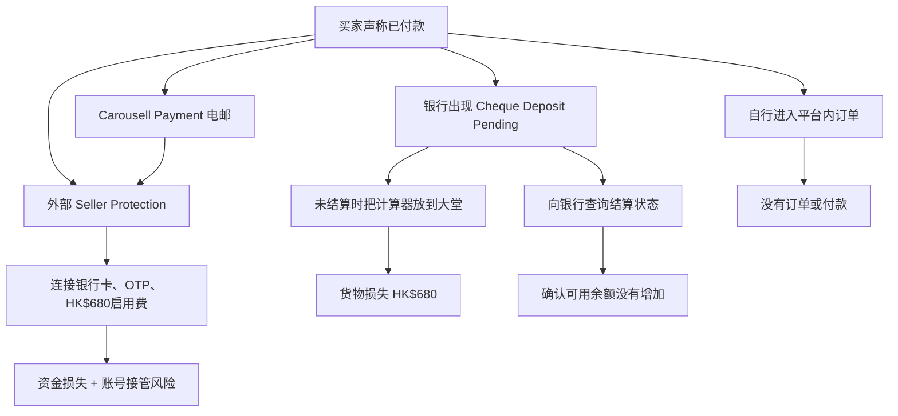

### 21.2 HA Go／eHealth 假扣费

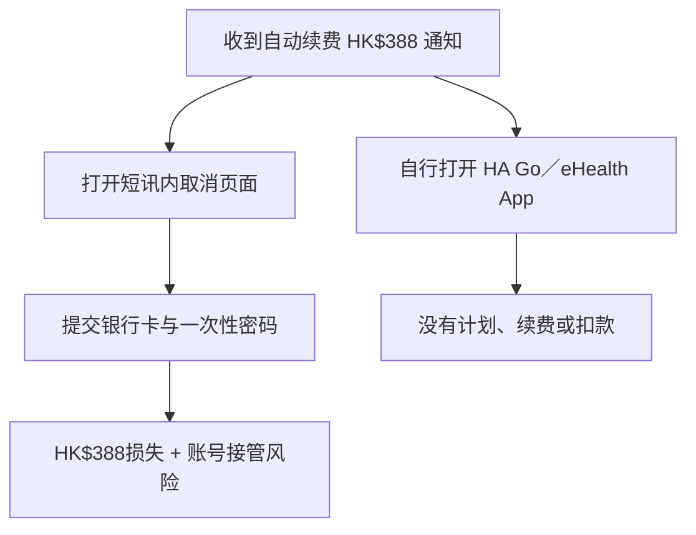

### 21.3 假冒 ADCC 二次追款

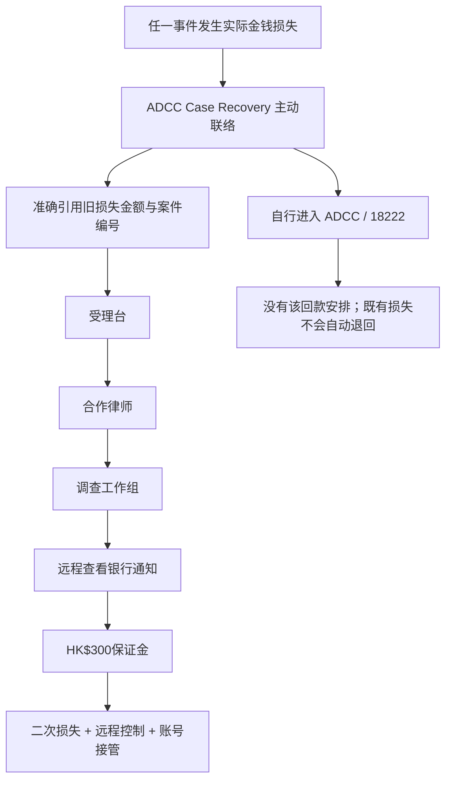

### 21.4 进阶假冒官员

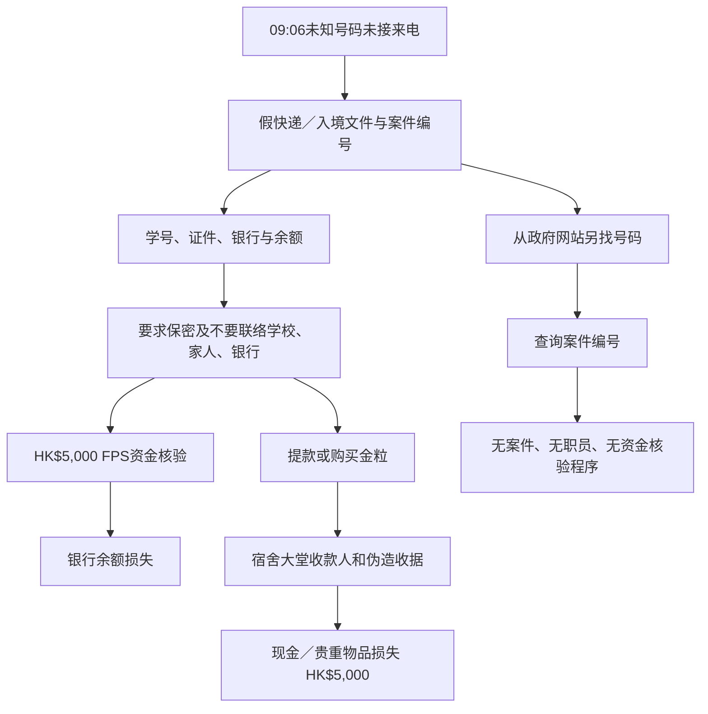

### 21.5 猜猜我是谁／熟人机制

```text
未知来电与熟人账号
├─ 来电者让玩家自己猜名字
│  ├─ 猜出“阿杰” → 对方接受身份 → 转账或大堂现金收款人
│  └─ 不提供名字 → 对方以旧活动片段继续试探
├─ Mandy 账号保留旧聊天、头像与熟悉语气
│  └─ 请求向第三方FPS垫付印刷费
└─ 独立路径
   ├─ 打回原号码
   └─ 联系共同联系人核实人物与权限
```

### 21.6 Meta 投资广告与假平台

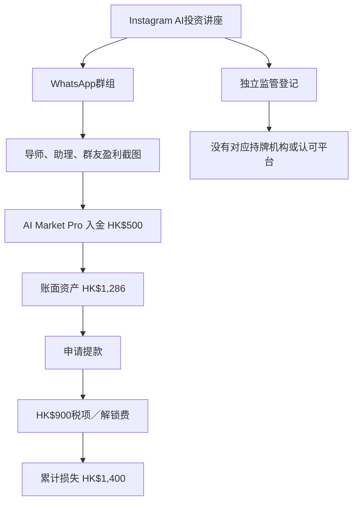

### 21.7 求职借贷

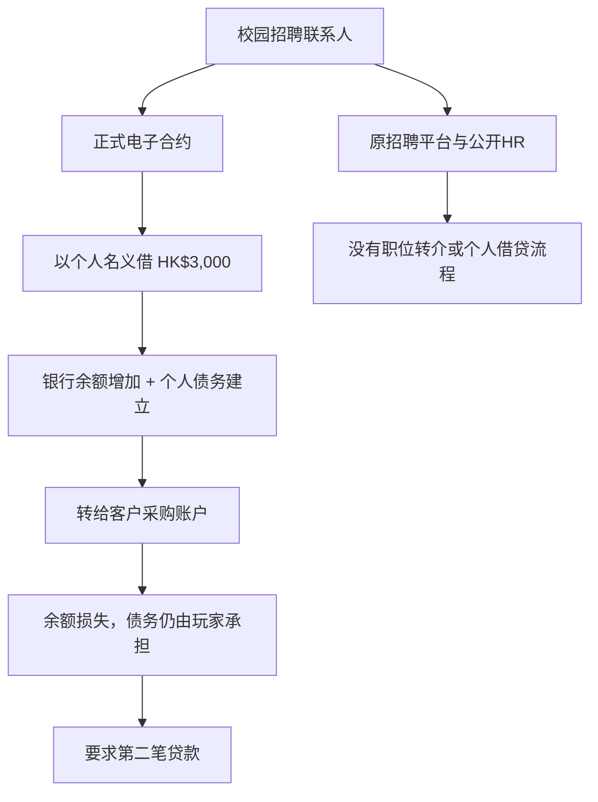

### 21.8 冒充教授／职员借钱

```text
Prof. Chan Office WhatsApp
├─ 声称正在教职员会议
├─ 研讨会供应商十点前要订金
├─ 要求向个人FPS先付HK$960
└─ 独立路径：PolyU教职员目录 → Department General Office
   └─ 教授没有私人借款、个人FPS或学生代垫安排
```

### 21.9 官方服务釣鱼组

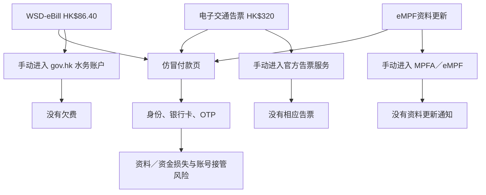

### 21.10 人口普查与虚假捐款

```text
人口普查访客
├─ 工作背心、职员证、宿舍大堂
├─ 出示身份证并提供住户资料 → 只发生资料外泄，不自动扣款
└─ 统计处独立入口 → 今天没有该探访

Donation Confirmation
├─ 声称HK$580今天自动扣除
├─ 回拨短讯号码 → 未知号码“取消中心”
├─ 提供网银资料与OTP → HK$580损失 + 账号接管风险
└─ 直接查看银行交易／自动转账 → 没有相应安排
```

### 21.11 v14 后果模型

| 维度 | 状态含义 |
| --- | --- |
| `moneyLost` | 已发生的银行余额／卡／转账损失 |
| `privacyExposure` | 玩家明确提交或说出的敏感资料次数／级别 |
| `consequences.goodsLost` | 未确认结算便交出的货物价值 |
| `consequences.debt` | 仍由玩家承担的个人贷款债务 |
| `consequences.cashOrValuablesLost` | 线下现金、黄金或贵重物品交收价值 |
| `consequences.accountTakeovers` | 提交密码、OTP或完整网银资料造成的账号接管风险 |
| `consequences.remoteAccess` | 允许远程查看设备／银行通知的次数 |
| `consequences.muleRisk` | 以个人账户代公司借贷、代收代转产生的风险 |

所有扣款、交货、债务和资料提交均由具体按钮触发，并用历史标签防止返回或重新进入时重复计算。官方查询只记录查询结果，不回滚已经发生的任何后果。
